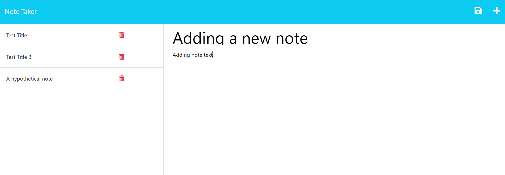

# SVG Logo Maker

## Description

This simple note-taker web app was built for the module 11 homework challenge for the Coding Bootcamp at UNC Chapel Hill. 

It utilizes a JSON file for data persistence, and express router for editing the data file contents to serve to the app.

## Installation

To load this program on your computer, simply navigate to the deployed app on Heroku at the following URL:

https://pdavidian-note-taker-cdd2afade116.herokuapp.com/

## Usage

After loading the app at the Heroku URL, follow these steps to use the app and see its functionality:

1 - To add a new Note, click the "+" icon at top-right, then simply type a Title and Text into the fields in the right-hand column, then hit the Save "disk" icon at top right.

2 - To view the contents of a previously saved Note, click on the Title of the note in the left-hand column. It will render the note contents in the right column.

3 - To delete a saved Note, click the Trash bin icon next to the Note in the left-hand column

## Appearance

The following image shows the application's appearance:

## License

MIT License

Copyright (c) 2023 Peej D

Permission is hereby granted, free of charge, to any person obtaining a copy
of this software and associated documentation files (the "Software"), to deal
in the Software without restriction, including without limitation the rights
to use, copy, modify, merge, publish, distribute, sublicense, and/or sell
copies of the Software, and to permit persons to whom the Software is
furnished to do so, subject to the following conditions:

The above copyright notice and this permission notice shall be included in all
copies or substantial portions of the Software.

THE SOFTWARE IS PROVIDED "AS IS", WITHOUT WARRANTY OF ANY KIND, EXPRESS OR
IMPLIED, INCLUDING BUT NOT LIMITED TO THE WARRANTIES OF MERCHANTABILITY,
FITNESS FOR A PARTICULAR PURPOSE AND NONINFRINGEMENT. IN NO EVENT SHALL THE
AUTHORS OR COPYRIGHT HOLDERS BE LIABLE FOR ANY CLAIM, DAMAGES OR OTHER
LIABILITY, WHETHER IN AN ACTION OF CONTRACT, TORT OR OTHERWISE, ARISING FROM,
OUT OF OR IN CONNECTION WITH THE SOFTWARE OR THE USE OR OTHER DEALINGS IN THE
SOFTWARE.
